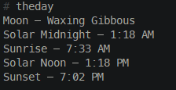

<!-- ⚠️ This README has been generated from the file(s) "blueprint.md" ⚠️--><h1 align="center">theday</h1>

  <b>Output useful sun and moon information.</b> 
  

This is pretty much just a wrapper for SunCalc that outputs the stuff I want to see.

## ➤ Table of Contents

* [➤ License](#-license)

## ➤ License
	
Licensed under [GPL-3.0](https://opensource.org/licenses/GPL-3.0).